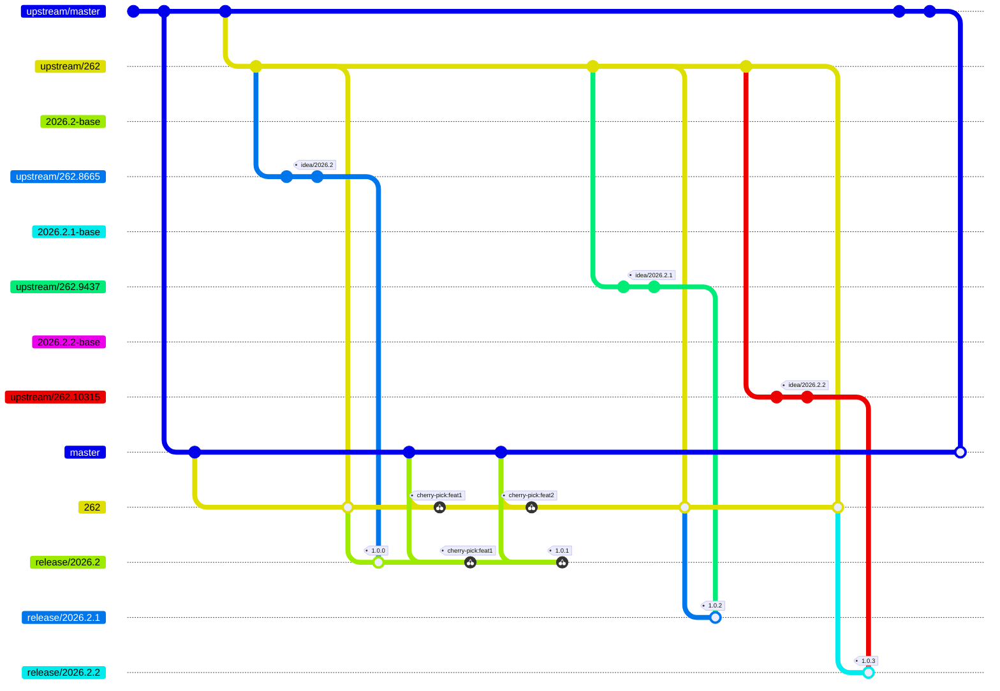

# Contributing

## AI Code Policy

This project does not accept any AI generated code.

Please also refrain from unnecessarily padding out your issues, comments or PR descriptions using LLMs. Though you may use AI to assist with translations if you aren't fluent in English.

If you are interested in the motivation behind this decision, [see here](https://detachhead.codeberg.page/workproperly/blog/2026/07/21/i-dont-like-ai/).

## Getting the Source Code

This section will guide you through getting the project sources and help avoid common issues in git config and other steps before opening it in the IDE.

#### Prerequisites
- [Git](https://git-scm.com/) installed
- Install [IntelliJ IDEA 2023.2](https://www.jetbrains.com/idea/download) or higher.
- For **Windows** set these git config to avoid common issues during cloning:
  ```
  git config --global core.longpaths true
  git config --global core.autocrlf input
  ```

#### Clone Main Repository

Rebased is available from the [GitHub repository](https://github.com/detachhead/rebased).
The **master** (_default_) branch contains the source code which is periodically merged with upstream, however Rebased tracks upstream IntelliJ Community releases in separate release branches. Releases are always published from the latest release branch instead of the master branch.
[See below](#keeping-up-to-date-with-upstream) for more info.

You can [clone this project](https://www.jetbrains.com/help/idea/manage-projects-hosted-on-github.html#clone-from-GitHub) directly using IntelliJ IDEA. 

Alternatively, follow the steps below in a terminal:

   ```
   git clone https://github.com/detachhead/rebased.git
   cd rebased
   ```

> [!TIP]
> - **For faster download**: If the complete repository history isn't needed, create [shallow clone](https://git-scm.com/docs/git-clone#Documentation/git-clone.txt---depthdepth)
> To download only the latest revision of the repository,  add `--depth 1` option after `clone`.
> - Cloning in IntelliJ IDEA also supports creating shallow clone.

---
## Building Rebased

These instructions will help you build Rebased from source code, which is based on the IntelliJ community edition.
IntelliJ IDEA '**2023.2**' or newer is required.

> [!IMPORTANT]
>
> IntelliJ IDEA project is currently being migrated to the [Bazel](https://bazel.build/) build system. 
> The migration is still in progress, so you may encounter some rough edges or temporary issues along the way, mostly related to IDE integration.
> * Building the project using only IDE built-in capabilities is not supported anymore, so make sure the [Bazel plugin](https://plugins.jetbrains.com/plugin/22977-bazel) is installed and enabled.
> * Known issue: some tests are not yet possible to be run with Bazel. In case of any issues, please depend on the `tests.cmd` script mentioned in the [Running IntelliJ IDEA in CI/CD environment](#running-intellij-idea-in-cicd-environment) section.

### Opening the Rebased Source Code in the IDE
Using the latest IntelliJ IDEA, click '**File | Open**', select the `<IDEA_HOME>` directory.
If IntelliJ IDEA displays a message about a missing or out-of-date required plugin (e.g. Kotlin),
[enable, upgrade, or install that plugin](https://www.jetbrains.com/help/idea/managing-plugins.html) and restart IntelliJ IDEA.


### Build Configuration Steps
1. **JDK Setup**

  - Use JetBrains Runtime 25 (without JCEF) to compile
  - IDE will prompt to download it on the first build
> [!IMPORTANT]
>
> JetBrains Runtime **without** JCEF is required. If `jbr-25` SDK points to JCEF version, change it to the non-JCEF version:
> - Add `idea.is.internal=true` to `idea.properties` and restart the IDE.
> - Go to '**Project Structure | SDKs**'
> - Click 'Browse' → 'Download...'
> - Select version 25 and vendor 'JetBrains Runtime'
> - To confirm if the JDK is correct, navigate to the SDK page with jbr-25 selected. Search for `jcef`, it should **_NOT_** yield a result.

2. **Maven Configuration** : If the **Maven** plugin is disabled, [add the path variable](https://www.jetbrains.com/help/idea/absolute-path-variables.html) "**MAVEN_REPOSITORY**" pointing to `<USER_HOME>/.m2/repository` directory.

3. **Memory Settings**
  - Ensure a minimum **8GB** RAM on your computer.
  - With the minimum RAM, disable "**Compile independent modules in parallel**" in '**Settings | Build, Execution, Deployment | Compiler**'.
  - With notably higher available RAM, Increase "**User-local heap size**" to `3000`.


### Building the Rebased Application from Source

**To build Rebased from source**, choose '**Build | Build Project**' from the main menu.

**To build installation packages**, run the [installers.cmd](installers.cmd) script in `<IDEA_HOME>` directory. `installers.cmd` will work on both Windows and Unix systems.
Options to build installers are passed as system properties to `installers.cmd` command.
You may find the list of available properties in [BuildOptions.kt](platform/build-scripts/src/org/jetbrains/intellij/build/BuildOptions.kt)

Pass --debug to suspend and wait for debugger at port 5005

Installer build examples:
```bash
# Build installers only for current operating system:
./installers.cmd -Dintellij.build.target.os=current
```

> [!TIP]
> 
> The `installers.cmd` is used to run [OpenSourceCommunityInstallersBuildTarget](build/src/OpenSourceCommunityInstallersBuildTarget.kt) from the command line.
> You can also call it directly from IDEA, using run configuration `Build Rebased Installers (current OS)`.


#### Dockerized Build Environment
To build installation packages inside a Docker container with preinstalled dependencies and tools, run the following command in `<IDEA_HOME>` directory (on Windows, use PowerShell):
```bash
docker build . --target intellij_idea --tag intellij_idea_env
docker run --rm --user "$(id -u)" --volume "${PWD}:/community" intellij_idea_env
```
> [!NOTE]
> 
> Please remember to specify the `--user "$(id -u)"` argument for the container's user to match the host's user.
> This prevents issues with permissions for the checked-out repository, the build output, if any.

---
## Running Rebased
To run the version of Rebased that was built from source, choose '**Run | Run**' from the main menu. This will use the preconfigured run configuration `Rebased`.

To run tests on the build, apply these settings to the '**Run | Edit Configurations... | Templates | JUnit**' configuration tab:
* Working dir: `<IDEA_HOME>/bin`
* VM options:  `-ea`


### Running Rebased in CI/CD environment

To run tests outside of IntelliJ IDEA, run the `tests.cmd` command in `<IDEA_HOME>` directory.`tests.cmd` can be used in both Windows and Unix systems.
Options to run tests are passed as system properties to `tests.cmd` command.
You may find the list of available properties in [TestingOptions.kt](platform/build-scripts/src/org/jetbrains/intellij/build/TestingOptions.kt)

```bash
./tests.cmd --module intellij.idea.community.main.tests
```
```bash
# Run a specific test: 
./tests.cmd --module intellij.idea.community.main.tests --test com.intellij.util.ArrayUtilTest
```

to debug tests use: `-Dintellij.build.test.debug.suspend=true -Dintellij.build.test.debug.port=5005`

`tests.cmd` is used just to run [CommunityRunTestsBuildTarget](build/src/CommunityRunTestsBuildTarget.kt) from the command line.
You can also call it directly from IDEA, see run configuration `tests` for an example.

## Keeping up-to-date with upstream

I try to keep rebased up-to-date with the latest releases of the IntelliJ IDEs. Specifically, I use the `idea/*` release tags as a base for
the Rebased releases. I aim to do a release within a few days of the upstream release.

This section details how exactly I do upstream merges. This is primarily for my own reference and not really relevant to contributors. All
you really need to know as a contributor is that if your change is specific to code not yet present in `master`, you may need to make your PR
to [the current release branch](https://github.com/DetachHead/rebased/pulls?q=is%3Apr+label%3A%22release+branch%22) instead.

### How upstream merging works

The way upstream does releases is extremely convoluted. Changes are initially merged into `master`, then cherry-picked into an intermediary
branch (eg. `262`), then cherry-picked into a release branch (eg. `262.8665`) where the tag is published (eg. `idea/2026.2`).

Unfortunately, each of these branches can contain commits that never end up in `master`, or even other release branches. This means we can't
just merge `upstream/master` into our own `master` branch to do releases, because it never contains the exact state of the code that's tied
to specific releases.

Here is a diagram demonstrating how I merge changes from upstream:



> [!NOTE]
> - the `*-base` branches (eg. `2026.2-base`) are only created for the purpose of merging the *base* (ie. common ancestor) of two branches/tags (eg. `upstream/262` and `idea/2026.2`) into our own `262` branch. This prevents us having to re-resolve the same conflicts for every subsequent `2026.*` release
> - This is not an accurate reflection of the history of this repo. The release tags are only examples and don't reflect the actual upstream version that those releases were based on.